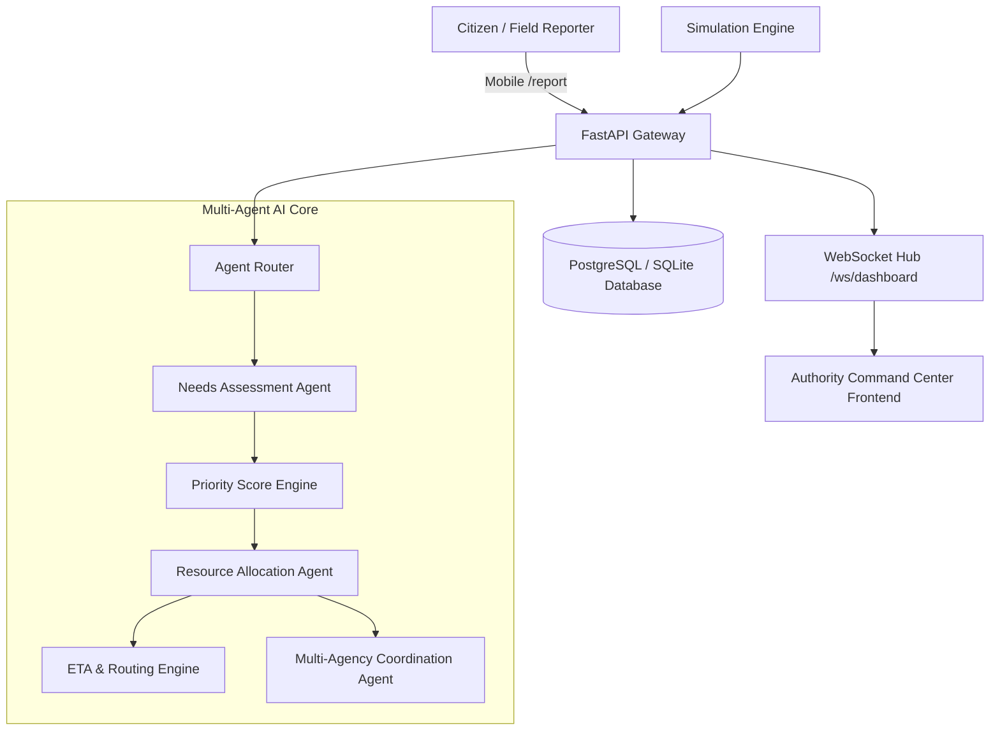

# PS20 System Architecture

## Overview
PS20 is an Agentic Disaster Relief & Emergency Resource Coordinator designed to orchestrate complex multi-agency disaster operations through specialized autonomous agents, live GIS telemetry, and real-time operator command interfaces.

## Agent Architecture Phasing
- **Phase 1 (Active)**: Database foundation, 5-zone baseline data, REST APIs, WebSockets, Command Center UI, Citizen Reporter, Simulation Engine.
- **Phase 2**: Structured LLM Needs Assessment Agent & Dynamic Multi-variable Priority Scoring.
- **Phase 3**: Optimization Allocation Agent (ILP / Simplex) & Realtime ETA Routing Engine.
- **Phase 4**: Multi-Agency Conflict Resolution & Live Resource Movement Telemetry.
- **Phase 5**: Mobile Offline-First Sync, GPS Geofencing, Photo Analysis.
- **Phase 6**: Multimodal Dispatch (SMS, IVR voice, Automated agency bridges).
